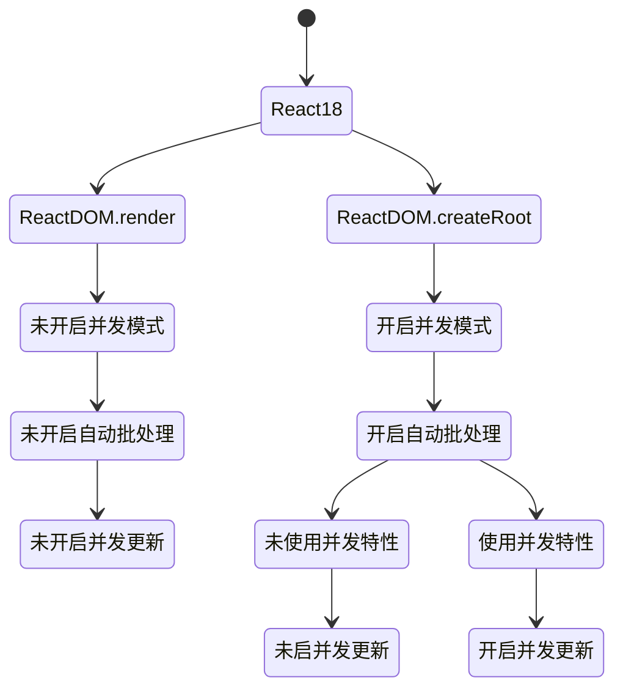

# How-to-Upgrade-to-React18

# 前言
.
在 2021 年 6 月份，[React 18 Working Group（React 18 工作组，简称 reactwg）](https://github.com/reactwg/react-18)成立了，并且公布了 v18 版本的发布计划，经过将近一年的迭代和准备，在 2022 年 3 月 29 日，React 18 正式版终于发布了。

可以在官网看到，`react 17` 的发布时间是 `2020 年 10 月 20 号`，距离 `React 18` 发布足足间隔一年半，并且v17中只有三个小版本，分别是`17.0.0`、`17.0.1`、`17.0.2`：

- **17.0.0** - `React 17` 正式版发布
- **17.0.1** - [只改动了 1 个文件](https://github.com/facebook/react/compare/v17.0.0...v17.0.1)，修复 ie 兼容问题，同时提升了 V8 内部对数组的执行性能
- **17.0.2** - 改动集中于 `Scheduler` 包, 主干逻辑没有变动，只与[性能统计相关](https://github.com/facebook/react/compare/v17.0.1...v17.0.2)

可以看到，在 `React 17` 的两次迭代中，都是只更新了补丁号，并且都是一些比较细节的更新，直到一年半之后的今天 `React 18` 正式版发布，`React 17` 都没有任何更新，所以 `React 17` 也被称为 `垫脚石版本`， 可以看出，`React 工作组` 对新特性的探索相当谨慎。

今天，我们就从开发者的角度来探索下 `React 18` 的一些新特性。

# 注意

`React 18` 已经放弃了对 `ie11` 的支持，将于 `2022年6月15日` 停止支持 `ie`，如需兼容，需要回退到 `React 17` 版本。

    React 18 中引入的新特性是使用现代浏览器的特性构建的，在IE中无法充分polyfill，比如micro-tasks

# 升级

- 新项目： 直接用 `npm` 或者 `yarn` 安装最新版依赖即可（如果是js，可以不需要安装types类型声明文件）

```js
npm i react react-dom --save
    
npm i @types/react @types/react-dom -D
```
    
- 旧项目： 先把依赖中的版本号改成最新，然后删掉 `node_modules` 文件夹，重新安装：

```js
npm i
```

# 新特性

## 一、 Render API

为了更好的管理`root节点`，`React 18` 引入了一个新的 `root API`，新的 `root API` 还支持 `new concurrent renderer`（并发模式的渲染），它允许你进入`concurrent mode`（并发模式）。

```ts
// React 17
import React from 'react';
import ReactDOM from 'react-dom';
import App from './App';

const root = document.getElementById('root')!;

ReactDOM.render(<App />, root);

// React 18
import React from 'react';
import ReactDOM from 'react-dom/client';
import App from './App';

const root = document.getElementById('root')!;

ReactDOM.createRoot(root).render(<App />);
```

同时，在卸载组件时，我们也需要将 `unmountComponentAtNode` 升级为 `root.unmount`:

```js
// React 17
ReactDOM.unmountComponentAtNode(root);

// React 18
root.unmount();
```

tips：我们如果在 `React 18` 中使用旧的 `render api`，在项目启动后，你将会在控制台中看到一个警告：


这表示你可以将项目直接升级到 `React 18` 版本，而不会直接造成 `break change`。如果你需要保持着 `React 17` 版本的特性的话，那么你可以无视这个报错，因为它在整个 `18` 版本中都是兼容的。

除此之外，`React 18` 还从 `render` 方法中删除了`回调函数`，因为当使用`Suspense`时，它通常不会有预期的结果。

在新版本中，如果需要在 `render` 方法中使用回调函数，我们可以在组件中通过 `useEffect` 实现：

```ts
// React 17
const root = document.getElementById('root')!;
ReactDOM.render(<App />, root, () => {
  console.log('渲染完成');
});

// React 18
const AppWithCallback: React.FC = () => {
  useEffect(() => {
    console.log('渲染完成');
  }, []);
  return <App />;
};
const root = document.getElementById('root')!;
ReactDOM.createRoot(root).render(<AppWithCallback />);
```

最后，如果你的项目使用了`ssr`服务端渲染，需要把`hydration`升级为`hydrateRoot`：

```ts
// React 17
import ReactDOM from 'react-dom';
const root = document.getElementById('root');
ReactDOM.hydrate(<App />, root);

// React 18
import ReactDOM from 'react-dom/client';
const root = document.getElementById('root')!;
ReactDOM.hydrateRoot(root, <App />);
```

另外，还需要更新 `TypeScript` 类型定义，如果你的项目使用了 `TypeScript`，最值得注意的变化是，现在在定义`props`类型时，如果需要获取子组件`children`，那么你需要`显式的定义它`，例如这样：

```ts
// React 17
interface MyButtonProps {
  color: string;
}

const MyButton: React.FC<MyButtonProps> = ({ children }) => {
  // 在 React 17 的 FC 中，默认携带了 children 属性
  return <div>{children}</div>;
};

export default MyButton;

// React 18
interface MyButtonProps {
  color: string;
  children?: React.ReactNode;
}

const MyButton: React.FC<MyButtonProps> = ({ children }) => {
  // 在 React 18 的 FC 中，不存在 children 属性，需要手动申明
  return <div>{children}</div>;
};

export default MyButton;
```

## 二、 setState 自动批处理

`React 18` 通过在默认情况下执行批处理来实现了开箱即用的性能改进。

批处理是指为了获得更好的性能，在数据层，将`多个状态更新`批量处理，合并成`一次更新`（在视图层，将`多个渲染`合并成`一次渲染`）。

### 1. 在 React 18 之前：

在`React 18 之前`，我们只在 `React 事件处理函数` 中进行批处理更新。默认情况下，在`promise`、`setTimeout`、`原生事件处理函数`中、或`任何其它事件内`的更新都不会进行批处理：

#### 情况一：React 事件处理函数

```tsx
import React, { useState } from 'react';

// React 18 之前
const App: React.FC = () => {
  console.log('App组件渲染了！');
  const [count1, setCount1] = useState(0);
  const [count2, setCount2] = useState(0);
  return (
    <button
      onClick={() => {
        setCount1(count => count + 1);
        setCount2(count => count + 1);
        // 在React事件中被批处理
      }}
    >
      {`count1 is ${count1}, count2 is ${count2}`}
    </button>
  );
};

export default App;
```

点击button，打印console.log：


可以看到，渲染次数和更新次数是一样的，即使我们更新了两个状态，每次更新组件也只渲染一次。

但是，如果我们把状态的更新放在`promise`或者`setTimeout`里面：

#### 情况二：setTimeout

```tsx
import React, { useState } from 'react';

// React 18 之前
const App: React.FC = () => {
  console.log('App组件渲染了！');
  const [count1, setCount1] = useState(0);
  const [count2, setCount2] = useState(0);
  return (
    <div
      onClick={() => {
        setTimeout(() => {
          setCount1(count => count + 1);
          setCount2(count => count + 1);
        });
        // 在 setTimeout 中不会进行批处理
      }}
    >
      <div>count1： {count1}</div>
      <div>count2： {count2}</div>
    </div>
  );
};

export default App;
```

点击button，重新打印console.log：


可以看到，每次点击更新两个状态，组件都会渲染两次，不会进行批量更新。

#### 情况三：原生js事件

```ts
import React, { useEffect, useState } from 'react';

// React 18 之前
const App: React.FC = () => {
  console.log('App组件渲染了！');
  const [count1, setCount1] = useState(0);
  const [count2, setCount2] = useState(0);
  useEffect(() => {
    document.body.addEventListener('click', () => {
      setCount1(count => count + 1);
      setCount2(count => count + 1);
    });
    // 在原生js事件中不会进行批处理
  }, []);
  return (
    <>
      <div>count1： {count1}</div>
      <div>count2： {count2}</div>
    </>
  );
};

export default App;
```
点击button，重新打印console.log：


可以看到，在原生js事件中，结果跟情况二是一样的，每次点击更新两个状态，组件都会渲染两次，不会进行批量更新。

### 2. 在 React 18 中：

在 `React 18` 上面的三个例子只会有一次 `render`，因为所有的更新都将自动批处理。这样无疑是很好的提高了应用的整体性能。

**不过以下例子会在 `React 18` 中执行两次 render**：

```tsx
import React, { useState } from 'react';

// React 18
const App: React.FC = () => {
  console.log('App组件渲染了！');
  const [count1, setCount1] = useState(0);
  const [count2, setCount2] = useState(0);
  return (
    <div
      onClick={async () => {
        await setCount1(count => count + 1);
        setCount2(count => count + 1);
      }}
    >
      <div>count1： {count1}</div>
      <div>count2： {count2}</div>
    </div>
  );
};

export default App;
```

### 总结：

- 在 18 之前，只有在react事件处理函数中，才会自动执行批处理，其它情况会多次更新
- 在 18 之后，任何情况都会自动执行批处理，多次更新始终合并为一次

## 三、flushSync

批处理是一个`破坏性改动`，如果你想退出批量更新，你可以使用 `flushSync`：

```tsx
import React, { useState } from 'react';
import { flushSync } from 'react-dom';

const App: React.FC = () => {
  const [count1, setCount1] = useState(0);
  const [count2, setCount2] = useState(0);
  return (
    <div
      onClick={() => {
        flushSync(() => {
          setCount1(count => count + 1);
        });
        // 第一次更新
        flushSync(() => {
          setCount2(count => count + 1);
        });
        // 第二次更新
      }}
    >
      <div>count1： {count1}</div>
      <div>count2： {count2}</div>
    </div>
  );
};

export default App;
```

注意：**`flushSync` 函数内部的多个 `setState` 仍然为批量更新**，这样可以精准控制哪些不需要的批量更新。

有关`批处理`和`flushSync`的更多信息，你可以参阅 React 官方的[Automatic batching deep dive（批处理深度分析）](https://github.com/reactwg/react-18/discussions/21)。

## 四、关于卸载组件时的更新状态警告

我们在开发时，偶尔会遇到以下错误：


这个错误表示：**无法对未挂载（已卸载）的组件执行状态更新。这是一个无效操作，并且表明我们的代码中存在内存泄漏。**

实际上，这个错误并不多见，在以往的版本中，这个警告被广泛误解，并且有些误导。

这个错误的初衷，原本旨在针对一些特殊场景，譬如 `你在useEffect里面设置了定时器，或者订阅了某个事件，从而在组件内部产生了副作用，而且忘记return一个函数清除副作用，则会发生内存泄漏……` 之类的场景

但是在实际开发中，更多的场景是，`我们在 useEffect 里面发送了一个异步请求，在异步函数还没有被 resolve 或者被 reject 的时候，我们就卸载了组件`。 在这种场景中，警告同样会触发。但是，在这种情况下，组件内部并没有内存泄漏，因为这个异步函数已经被垃圾回收了，此时，**警告具有误导性**。

关于这点，React 官方也有解释：


综上所述原因，在 `React 18` 中，官方删除了这个报错。

有关这个报错的更多信息，你可以参阅 React 官方的说明，[点击这里](https://github.com/reactwg/react-18/discussions/82)查看。

## 五、关于 React 组件的返回值

- 在 `React 17` 中，如果你需要返回一个`空组件`，React只允许返回`null`。如果你显式的返回了 `undefined`，控制台则会在运行时抛出一个错误。
-  在 `React 18` 中，不再检查因返回 `undefined` 而导致崩溃。既能返回 `null`，也能返回 `undefined`（但是 `React 18` 的`dts`文件还是会检查，只允许返回 `null`，你可以忽略这个类型错误）。

关于组件返回值的官方解释： [https://github.com/reactwg/react-18/discussions/75](https://github.com/reactwg/react-18/discussions/75)

## 六、Strict Mode

不再抑制控制台日志：

当你使用`严格模式`时，React 会对每个组件进行`两次渲染`，以便你观察一些意想不到的结果。在 `React 17` 中，取消了`其中一次渲染`的控制台日志，以便让日志更容易阅读。

为了解决社区对这个问题的困惑，在 `React 18` 中，官方取消了这个限制。如果你安装了`React DevTools`，第二次渲染的日志信息将显示为灰色，以柔和的方式显式在控制台。


关于 Strict Mode 的官方解释： [https://github.com/reactwg/react-18/discussions/96](https://github.com/reactwg/react-18/discussions/96)

## 七、 Suspense 不再需要 fallback 来捕获

在 `React 18` 的 `Suspense` 组件中，官方对 `空的fallback` 属性的处理方式做了改变：不再跳过 `缺失值` 或 `值为null` 的 `fallback` 的 `Suspense` 边界。相反，会捕获边界并且向外层查找，如果查找不到，将会把 `fallback` 呈现为 `null`。

### 更新前：

以前，如果你的 `Suspense` 组件没有提供 `fallback` 属性，React 就会悄悄跳过它，继续向上搜索下一个边界：

```tsx
// React 17
const App = () => {
  return (
    <Suspense fallback={<Loading />}> // <--- 这个边界被使用，显示 Loading 组件
      <Suspense>                      // <--- 这个边界被跳过，没有 fallback 属性
        <Page />
      </Suspense>
    </Suspense>
  );
};

export default App;
```

React 工作组发现这可能会导致混乱、难以调试的情况发生。例如，你正在debug一个问题，并且在没有 `fallback` 属性的 `Suspense` 组件中抛出一个边界来测试一个问题，它可能会带来一些意想不到的结果，并且 `不会警告` 说它 `没有fallback` 属性。

### 更新后：

现在，React将使用当前组件的 `Suspense` 作为边界，即使当前组件的 `Suspense` 的值为 `null` 或 `undefined`：

```tsx
// React 18
const App = () => {
  return (
    <Suspense fallback={<Loading />}> // <--- 不使用
      <Suspense>                      // <--- 这个边界被使用，将 fallback 渲染为 null
        <Page />
      </Suspense>
    </Suspense>
  );
};

export default App;
```

这个更新意味着我们`不再跨越边界组件`。相反，我们将在边界处捕获并呈现 `fallback`，就像你提供了一个返回值为 `null` 的组件一样。这意味着被挂起的 `Suspense` 组件将按照预期结果去执行，如果忘记提供 `fallback` 属性，也不会有什么问题。

关于 Suspense 的官方解释： [https://github.com/reactwg/react-18/discussions/72](https://github.com/reactwg/react-18/discussions/72)

# 新的 API

## 一、useId

```js
const id = useId();
```

支持同一个组件在客户端和服务端生成相同的唯一的 ID，避免 `hydration` 的不兼容，这解决了在 `React 17` 及 `17` 以下版本中已经存在的问题。因为我们的服务器渲染时提供的 `HTML` 是`无序的`，`useId` 的原理就是每个 `id` 代表该组件在组件树中的层级结构。

有关useId的更多信息，请参阅 [useId post in the working group](https://github.com/reactwg/react-18/discussions/111)。

## 二、useSyncExternalStore

`useSyncExternalStore` 是一个新的api，经历了一次修改，由 `useMutableSource` 改变而来，主要用来解决外部数据撕裂问题。

useSyncExternalStore 能够通过强制同步更新数据让 React 组件在 CM 下安全地有效地读取外接数据源。 在 Concurrent Mode 下，React 一次渲染会分片执行（以 fiber 为单位），中间可能穿插优先级更高的更新。假如在高优先级的更新中改变了公共数据（比如 redux 中的数据），那之前低优先的渲染必须要重新开始执行，否则就会出现前后状态不一致的情况。

`useSyncExternalStore` 一般是三方状态管理库使用，我们在日常业务中不需要关注。因为 `React` 自身的 `useState` 已经原生的解决的并发特性下的 `tear（撕裂）`问题。`useSyncExternalStore` 主要对于框架开发者，比如 `redux`，它在控制状态时可能并非直接使用的 `React` 的 `state`，而是自己在外部维护了一个 `store` 对象，用`发布订阅模式`实现了数据更新，脱离了 `React` 的管理，也就无法依靠 `React` 自动解决撕裂问题。因此 `React` 对外提供了这样一个 API。

目前 `React-Redux 8.0` 已经基于 `useSyncExternalStore` 实现。

有关useSyncExternalStore的更多信息，请参阅 [useSyncExternalStore overview post](https://github.com/reactwg/react-18/discussions/70) 和 [useSyncExternalStore API details](https://github.com/reactwg/react-18/discussions/86)。

## 三、useInsertionEffect

```tsx
const useCSS = rule => {
  useInsertionEffect(() => {
    if (!isInserted.has(rule)) {
      isInserted.add(rule);
      document.head.appendChild(getStyleForRule(rule));
    }
  });
  return rule;
};

const App: React.FC = () => {
  const className = useCSS(rule);
  return <div className={className} />;
};

export default App;
```

这个 Hooks 只建议 `css-in-js` 库来使用。 这个 Hooks 执行时机在 `DOM` 生成之后，`useLayoutEffect` 之前，它的工作原理大致和 `useLayoutEffect` 相同，只是此时无法访问 `DOM` 节点的引用，一般用于提前注入 `<style>` 脚本。

有关useInsertionEffect的更多信息，请参阅 [Library Upgrade Guide for `<style>`](https://github.com/reactwg/react-18/discussions/110)。

# Concurrent Mode（并发模式）

Concurrent Mode（以下简称 `CM`）翻译叫并发模式，这个概念我们或许已经听过很多次了，实际上，在去年这个概念已经很成熟了，在 `React 17` 中就可以通过一些`试验性`的api开启 `CM`。

    CM 本身并不是一个功能，而是一个底层设计
    
并发模式可帮助应用保持响应，并根据用户的设备性能和网速进行适当的调整，该模式通过使渲染可中断来修复`阻塞渲染`限制。在 `Concurrent` 模式中，`React` 可以同时更新多个状态。

说的太复杂可能有点拗口，总结一句话就是：

`React 17` 和 `React 18` 的区别就是：从`同步不可中断更新`变成了`异步可中断更新`。

## 重点来了，阅读下面的部分请勿跳过：

我们在文章开始提到过：在 `React 18` 中，提供了新的 `root api`，我们只需要把 `render` 升级成 `createRoot(root).render(<App />)` 就可以开启并发模式了。

那么这个时候，可能有同学会提问：**开启`并发模式`就是开启了`并发更新`么？**

NO！ 在 `React 17` 中一些实验性功能里面，开启`并发模式`就是开启了`并发更新`，但是在 `React 18` 正式版发布后，由于官方策略调整，React 不再依赖`并发模式`开启`并发更新`了。

换句话说：开启了`并发模式`，并不一定开启了`并发更新`！

一句话总结：**在 `18` 中，不再有多种模式，而是以`是否使用并发特性`作为`是否开启并发更新`的依据**。

从最老的版本到当前的`v18`，市面上有多少个版本的`React`？

可以从架构角度来概括下，当前一共有两种架构：

-   采用不可中断的`递归`方式更新的`Stack Reconciler`（老架构）
-   采用可中断的`遍历`方式更新的`Fiber Reconciler`（新架构）

新架构可以选择是否开启`并发更新`，所以当前市面上所有 `React` 版本有四种情况：

1. 老架构（v15及之前版本）
2. 新架构，未开启并发更新，与情况1行为一致（v16、v17 默认属于这种情况）
3. 新架构，未开启并发更新，但是启用了并发模式和一些新功能（比如 `Automatic Batching`，v18 默认属于这种情况）
4. 新架构，开启并发模式，开启并发更新

`并发特性`指开启`并发更新`后才能使用的特性，比如：

- `useDeferredValue`
- `useTransition`

关系图：



了解清楚他们的关系之后，我们可以继续探索`并发更新`了：

## 并发特性：

### 一、startTransition

在v18中运行如下代码：

```tsx
import React, { useState, useEffect, useTransition } from 'react';

const App: React.FC = () => {
  const [list, setList] = useState<any[]>([]);
  const [isPending, startTransition] = useTransition();
  useEffect(() => {
    // 使用了并发特性，开启并发更新
    startTransition(() => {
      setList(new Array(10000).fill(null));
    });
  }, []);
  return (
    <>
      {list.map((_, i) => (
        <div key={i}>{i}</div>
      ))}
    </>
  );
};

export default App;
```

由于 `setList` 在 `startTransition` 的回调函数中执行（使用了`并发特性`），所以 `setList` 会触发`并发更新`。

`startTransition`，主要为了能在大量的任务下也能保持 UI 响应。这个新的 API 可以通过将特定更新标记为`“过渡”`来显著改善用户交互，简单来说，就是被 `startTransition` 回调包裹的 `setState` 触发的渲染被标记为不紧急渲染，这些渲染可能被其他`紧急渲染`所抢占。

- 有关startTransition的更多信息，请参阅 [Patterns for startTransition](https://github.com/reactwg/react-18/discussions/100)。

### 二、useDeferredValue

返回一个延迟响应的值，可以让一个`state` 延迟生效，只有当前没有紧急更新时，该值才会变为最新值。`useDeferredValue` 和 `startTransition` 一样，都是标记了一次非紧急更新。

从介绍上来看 `useDeferredValue` 与 `useTransition` 是否感觉很相似呢？

- 相同：`useDeferredValue` 本质上和内部实现与 `useTransition` 一样，都是标记成了`延迟更新`任务。
- 不同：`useTransition` 是把更新任务变成了延迟更新任务，而 `useDeferredValue` 是产生一个新的值，这个值作为延时状态。（一个用来包装方法，一个用来包装值）

所以，上面 `startTransition` 的例子，我们也可以用 `useDeferredValue` 来实现：

```tsx
import React, { useState, useEffect, useDeferredValue } from 'react';

const App: React.FC = () => {
  const [list, setList] = useState<any[]>([]);
  useEffect(() => {
    setList(new Array(10000).fill(null));
  }, []);
  // 使用了并发特性，开启并发更新
  const deferredList = useDeferredValue(list);
  return (
    <>
      {deferredList.map((_, i) => (
        <div key={i}>{i}</div>
      ))}
    </>
  );
};

export default App;
```
然后启动项目，查看一下打印的执行堆栈图：


此时我们的任务被拆分到每一帧不同的 `task` 中，`JS脚本`执行时间大体在`5ms`左右，这样浏览器就有剩余时间执行**样式布局**和**样式绘制**，减少掉帧的可能性。

- 有关useDeferredValue的更多信息，请参阅 [New in 18: useDeferredValue](https://github.com/reactwg/react-18/discussions/129)。

### 三、普通情况

我们可以关闭并发特性，在普通环境中运行项目：

```tsx
import React, { useState, useEffect } from 'react';

const App: React.FC = () => {
  const [list, setList] = useState<any[]>([]);
  useEffect(() => {
    setList(new Array(10000).fill(null));
  }, []);
  return (
    <>
      {list.map((_, i) => (
        <div key={i}>{i}</div>
      ))}
    </>
  );
};

export default App;
```

启动项目，查看一下打印的执行堆栈图：


可以从打印的执行堆栈图看到，此时由于组件数量繁多（10000个），JS执行时间为`500ms`，也就是意味着，在没有并发特性的情况下：一次性渲染10000个标签的时候，页面会阻塞大约`0.5秒`，造成卡顿，但是如果开启了并发更新，就不会存在这样的问题。

     这种将长任务分拆到每一帧中，像蚂蚁搬家一样一次执行一小段任务的操作，被称为时间切片（time slice）

## 结论

- 并发更新的意义就是`交替执行`不同的任务，当预留的时间不够用时，`React` 将线程控制权交还给浏览器，等待下一帧时间到来，然后继续被中断的工作
- `并发模式`是实现`并发更新`的基本前提
- `时间切片`是实现`并发更新`的具体手段

# 结语

以上是本次 `React` 所升级的大致内容，如有错误，敬请指正。

# 参考资料

- [React v18.0](https://react.docschina.org/blog/2022/03/29/react-v18.html)
- [How to Upgrade to React 18](https://react.docschina.org/blog/2022/03/08/react-18-upgrade-guide.html)
- [React 18 工作组](https://github.com/reactwg/react-18/discussions)
- [React 18 不再依赖 Concurrent Mode 开启并发更新了](https://mp.weixin.qq.com/s/tC2VF_uIZf4RfBWdlpaKUA)
